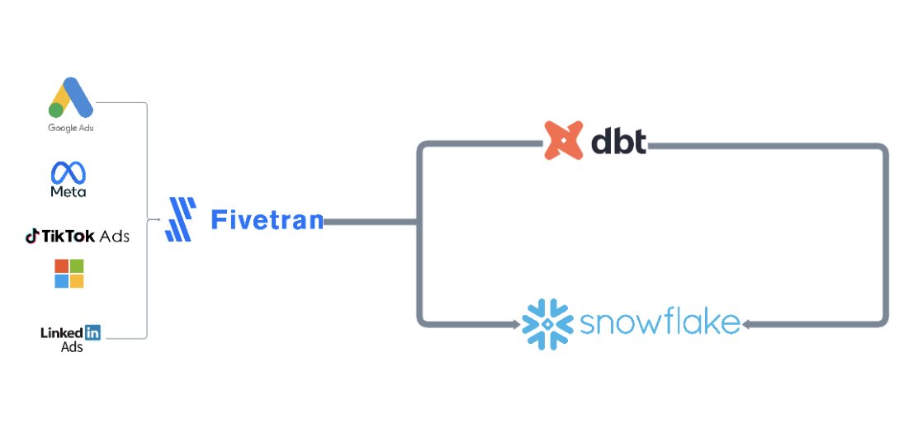
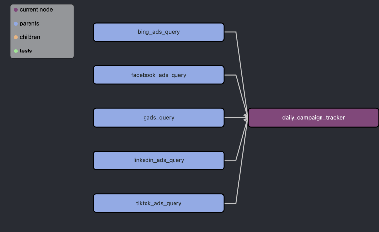

# Modeling Ad platforms data with Fivetran, Snowflake and dbt
Get data at campaign level of Google, Meta, Tiktok, Bing and Linkedin Ads. 

# Introduction & Goals
- Using Fivetran to get ad platform raw data into Snowflake
- Adding sources for dbt setup 
- Data transformation with dbt and send it back to Snowflake

# Contents

- [Used Tools](#used-tools)
  - [Fivetran](#fivetran)
  - [dbt & Snowflake](#dbt)
- [Follow Me On](#follow-me-on)

# Used Tools
- Fivetran for data ingestion
- Snowflake for data warehousing
- dbt for transformation layer

# Fivetran
- Understanding Google Ads ERD: https://fivetran.com/docs/applications/google-ads 
- Understanding Meta Ads ERD: https://fivetran.com/docs/applications/facebook-ads
- Understanding Microsoft Ads ERD: https://fivetran.com/docs/applications/microsoft-advertising 
- Understanding Linkedin Ads ERD: https://www.fivetran.com/connectors/linkedin-ad-analytics 
- Understanding Tiktok Ads ERD: https://fivetran.com/docs/applications/tiktok-ads
- Setting up neccesary reports for final model layout.

# dbt

Finally, all models are ensembled together by an union all (check lineage below). For each sub-model, there is an example macro to extract the country from a campaign string. 

The sources for staging models are listed in sources.yml

The dbt project structure is following medallion approach (bronze, silver and gold) with dbt version: staging and marts.

Note: some column names might differ from the final dbt model.

# Follow Me On
Linkedin: https://www.linkedin.com/in/alejandro-aboy/ 
