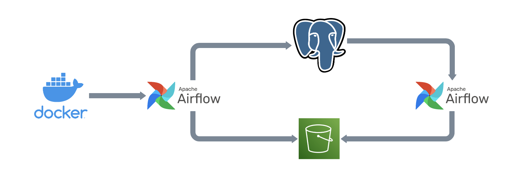
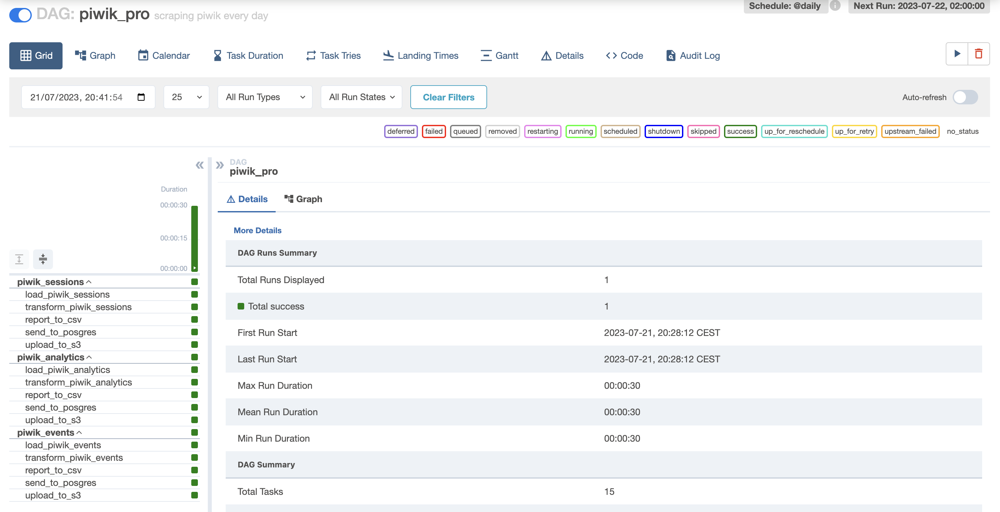
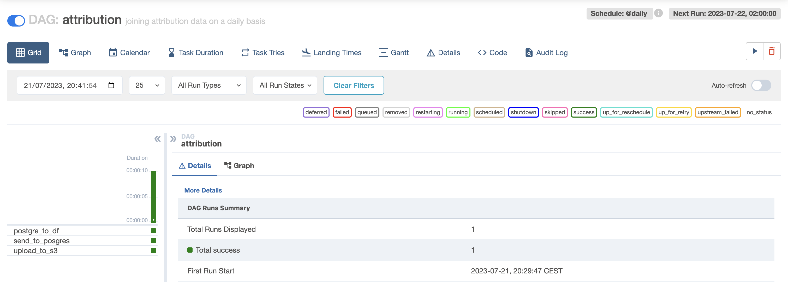
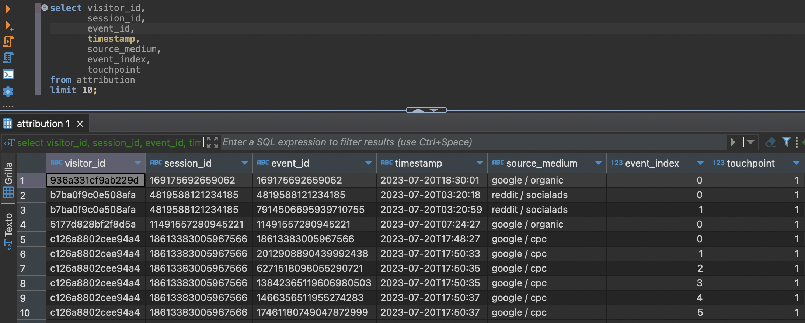
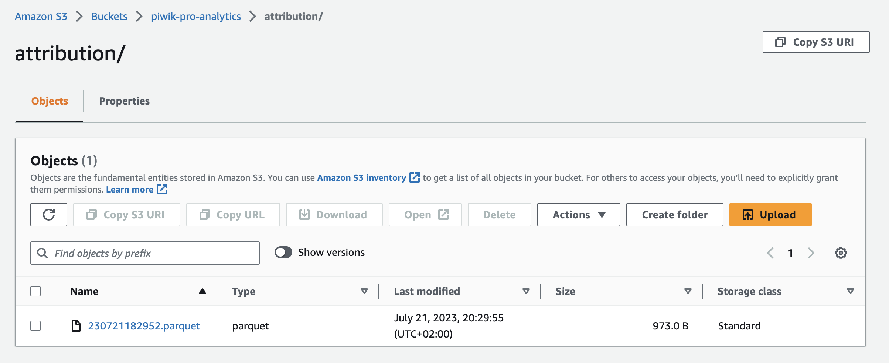

# Extracting and storing daily traffic data with Airflow, PostgreSQL and S3
PiwikPRO became a good alternative for replacing Google Analytics. In this pipeline I extract data from its API, parse it and save it into PostgreSQL and S3. An extra transformation is done in PostgreSQL, also orchrestrated by Airflow,

# Introduction & Goals
- Setting up Airflow pipeline to request traffic data every day.
- Using Airflow to get raw data into PostgreSQL and Amazon S3
- Run query in PostgreSQL to connect attribution data and get it back to PostgreSQL and Amazon S3.

# Contents

- [Used Tools](#used-tools)
  - [Airflow](#airflow)
  - [PostgreSQL](#postgreSQL)
  - [Amazon S3](#s3)
- [Follow Me On](#follow-me-on)

# Used Tools
- Mage for pipeline orchrestation and extraction.
- PostgreSQL as RDS.
- Amazon S3 as data lake.

# Airflow
- Setup extraction from PiwikPRO analytics, events and sessions API.
- Transform and clean output
- Export to PostgreSQL and Amazon S3.
- Run query in PostgreSQL to connect attribution data and export again.
- Use decorators, operators and OOP.

You can see all the python code in /dags

# postgreSQL

With airflows conenction, data is added to PostgreSQL destination.

# s3

After creating airflow connections and setting up the bucket, the parquets are added to Amazon S3.

# Follow Me On
Linkedin: https://www.linkedin.com/in/alejandro-aboy/ 
