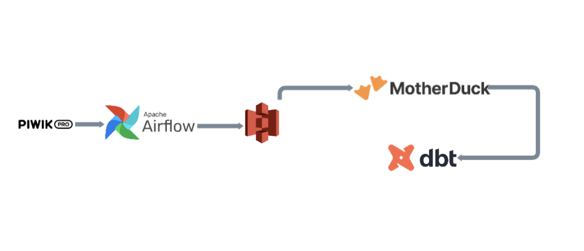
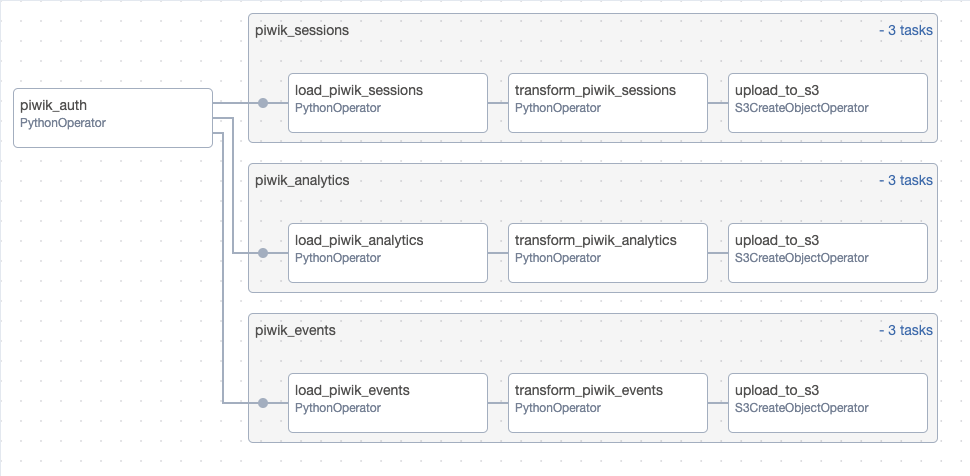
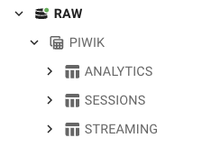
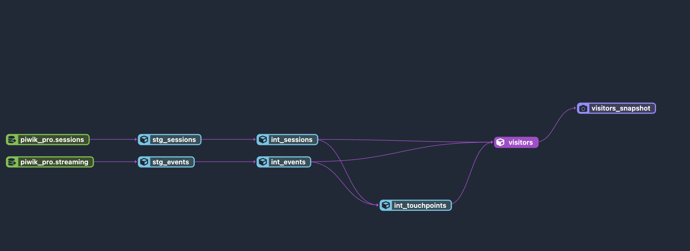
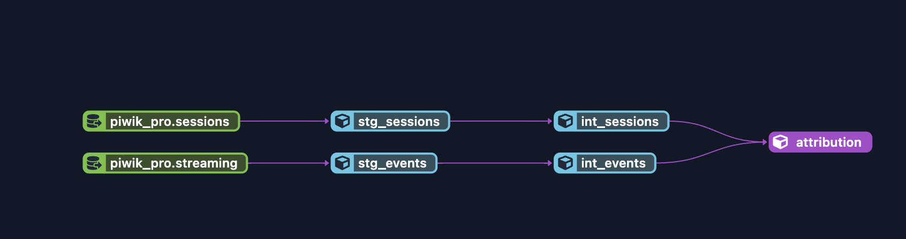

# Building a full ETL process for PiwikPRO (Traffic Analytics Tool) with Airflow, Motherduck, Amazon S3 and dbt core.

# Introduction & Goals
- Capture APIs data with Airflow and send it to S3.
- Setup Motherduck for batch processing through S3 Stages.
- Transform, test and build data models with dbt core.

# Contents

- [Used Tools](#used-tools)
  - [Airflow](#Airflow)
  - [Motherduck](#Motherduck)
  - [dbt](#dbt)
- [Follow Me On](#follow-me-on)

# Used Tools

# Airflow

- OOP approach with Classes/methods to capture API raw_data.
- Used Airflow Variables.
- Used TaskGroups, PythonOperators and S3BucketOperators to manage all the flow. 
- Applied transformations with pandas.

# Motherduck

- DDL for new tables.
- Created Stages and copied data from S3 bucket paths.

(Check sql for more detail on Motherduck code.)

# dbt
- Followed dbt recommended folder structure, added sources and used macros.
- Added a testing layer with generic tests and dbt_expectations.
- Building a visitor SCD model with snapshots.

Note: screenshots were taken from a dbt cloud implementation for the same model.

- Building a full funnel attribution history with all the models. 

Note: screenshots were taken from a dbt cloud implementation for the same model.

# Follow Me On
Linkedin: https://www.linkedin.com/in/alejandro-aboy/ 

