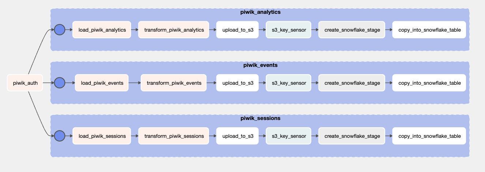

# Building a full ETL process for PiwikPRO (Traffic Analytics Tool) with Airflow, Snowflake, Snowpipe, Amazon S3 and dbt cloud.

# Introduction & Goals
- Capture APIs data with Airflow and send it to S3.
- Setup Snowflake for batch processing through S3 Stages.
- Setup Snowpipe for streaming processing through S3 Stages.
- Transform, test and build data models with dbt.

# Contents

- [Used Tools](#used-tools)
  - [Airflow](#Airflow)
  - [Snowflake](#Snowflake)
  - [dbt](#dbt)
- [Follow Me On](#follow-me-on)

# Used Tools

# Airflow

- OOP approach with Classes/methods to capture API raw_data.
- Used Airflow Variables.
- Used TaskGroups, PythonOperators and S3BucketOperators to manage all the flow. 
- Applied transformations with pandas.

### TO DO: 
- handle Snowflake stage creation and "COPY INTO" command through Airflow. 
- Check if tables exist before pushing data from stage. 
- Change to parquet instead of csv. 

# Snowflake

- Created Amazon S3 Integrations.
- DDL for new tables.
- Created Stages and copied data from S3 bucket paths.
- Created Snowpipe to handle streaming copying workflow for a specific S3 path. 

(Check sql folder for more detail on Snowflake code.)

### TO DO 
- Use ARN auth instead of keys.

# dbt
- Followed dbt recommended folder structure, added sources and used macros.
- Added a testing layer with generic tests and dbt_expectations.
- Added Elementary packages for observability. 
- Added CI/CD Job on dbt cloud. 
- Building a visitor SCD model with snapshots.

- Building a full funnel attribution history with all the models. 

# Follow Me On
Linkedin: https://www.linkedin.com/in/alejandro-aboy/ 

