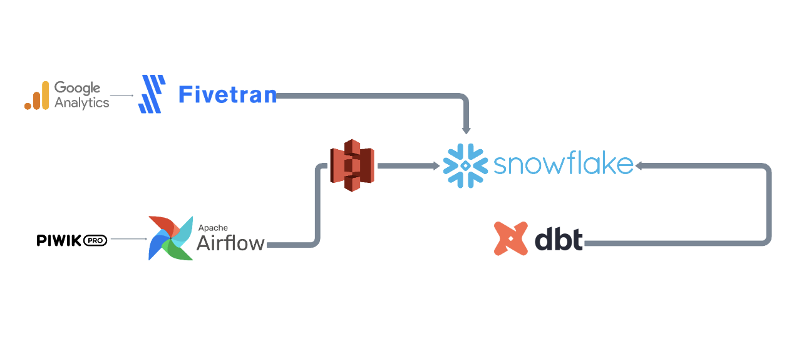

# Modeling Google Analytics and PiwikPRO traffic dataset for smooth migration.
Considering Google Analytics deprecation on July 2023, PiwikPRO appeared as an alternative to replace the tool. 

# Introduction & Goals
- Using Fivetran to get Google Analytics raw data into Snowflake
- Using Airflow to get PiwikPRO raw data into Snowflake (PENDING)
- Adding sources for dbt setup (simplified files, overall repo is not upload)
- Data transformation with dbt and send it back to Snowflake

# Contents

- [Used Tools](#used-tools)
  - [Airflow](#Airflow)
  - [Fivetran](#fivetran)
  - [dbt & Snowflake](#dbt)
- [Follow Me On](#follow-me-on)

# Used Tools
- Fivetran for data ingestion
- dbdiagram.io for data modeling
- Snowflake for data warehousing
- dbt for transformation layer

# Fivetran
- Understanding Google Analytics ERD (deprecated): https://fivetran.com/docs/applications/google-analytics
- Setting up neccesary reports for final model layout.

# Airflow 
- TODO: Add core of Airflow DAGs
- TODO: Add snowpipe to S3 

- PiwikPRO does not have a Fivetran connector at the moment, so the API is directly scraped to get the raw data into Snowflake.

# dbt

Both staging models have surrogate keys, incremental stategy (because of its huge workload and fact granularity) with one-day batch window. The sources for this raw data are listed in /sources file and the /models are as shown below:

Note: some column names might differ from the final dbt model.

# Follow Me On
Linkedin: https://www.linkedin.com/in/alejandro-aboy/ 

