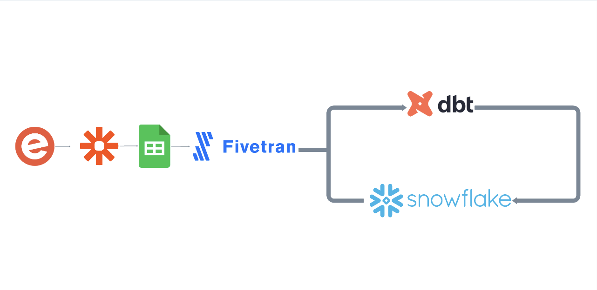
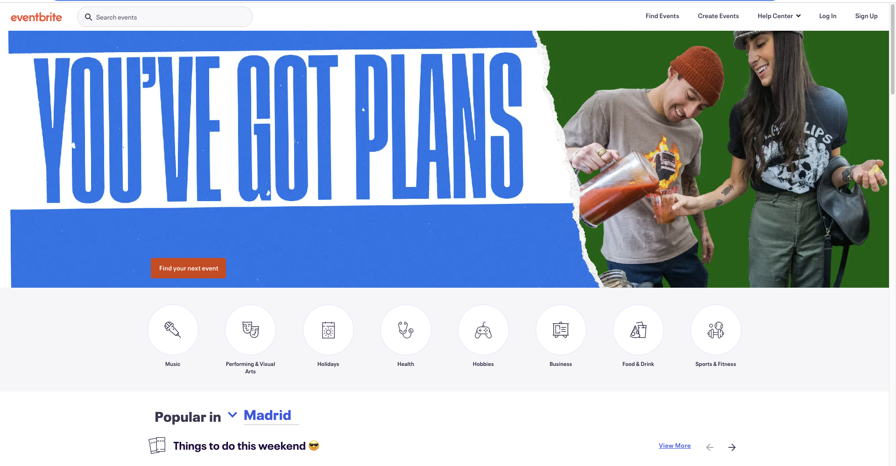
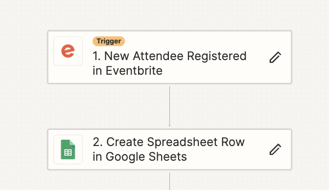

# Using no_code automations to generate an ETL process with Zapier, Fivetran and dbt
Getting data of Eventbrite API through Zapier and sending it to Google Sheets ingested by Fivetran. Logics are applied through dbt to apply incremental models. 

# Contents

- [Used Tools](#used-tools)
  - [Zapier & Fivetran](#zapier)
  - [dbt & Snowflake](#dbt)
- [Follow Me On](#follow-me-on)

# Used Tools
- Zapier for no code automation of Eventbrite API
- Fivetran for data ingestion of Google Sheets
- Snowflake for data warehousing
- dbt for transformation layer

# Zapier
- Getting Eventbrite registrants to land into a Google Sheets through Zapier
  

- The main was to generate a pseudo attribution system to measure Eventbrite's impact without having a Salesforce/Eventbrite native integration in place. We would check by joining hashed email keys if the lead was part of an event before or after the lead creation that.
  

- We've used Fivetran to ingest Google Sheets data. You can check the sample_output.csv to know more about the file. 
- Note: this same process could be also achieved by using Fivetran Eventbrite connectors.

# dbt

Finally we build the model incrementally by joining salesforce and eventbrite data to confirm the impact of offline events in CRM leads. 

# Follow Me On
Linkedin: https://www.linkedin.com/in/alejandro-aboy/ 
