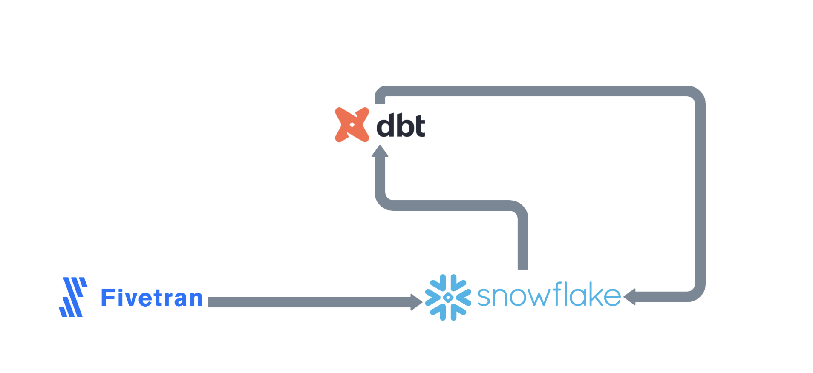
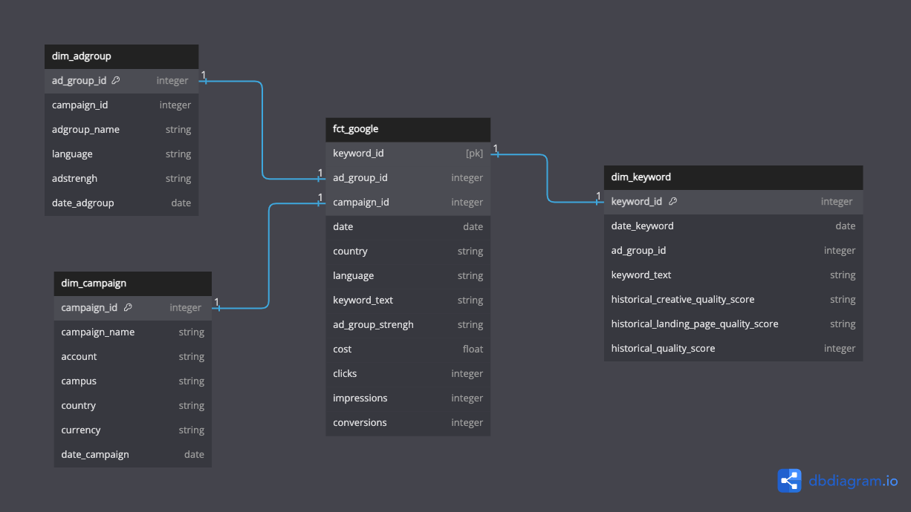
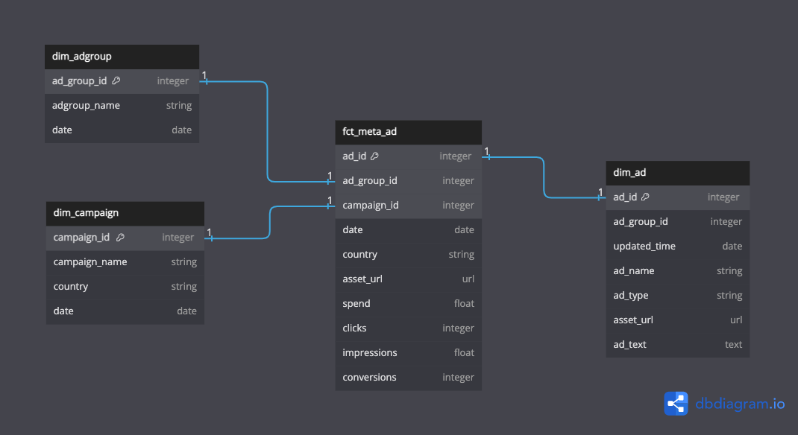
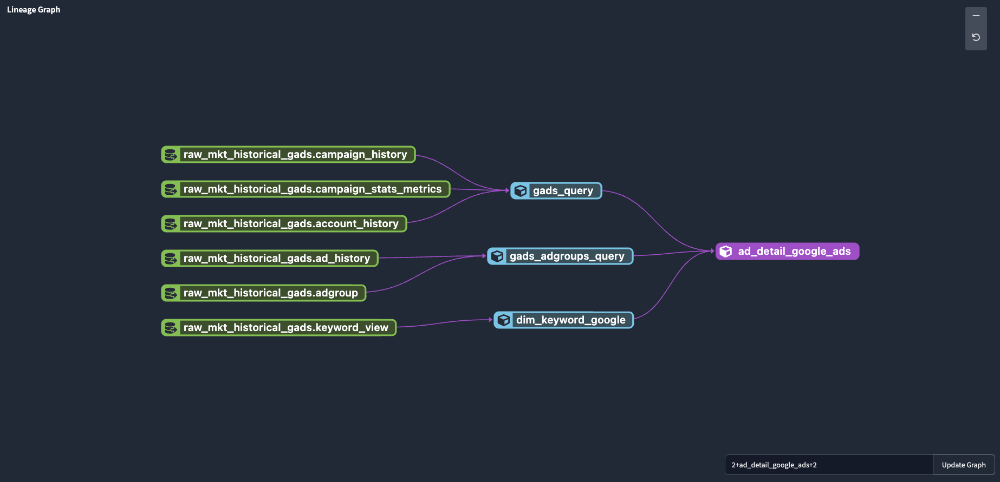
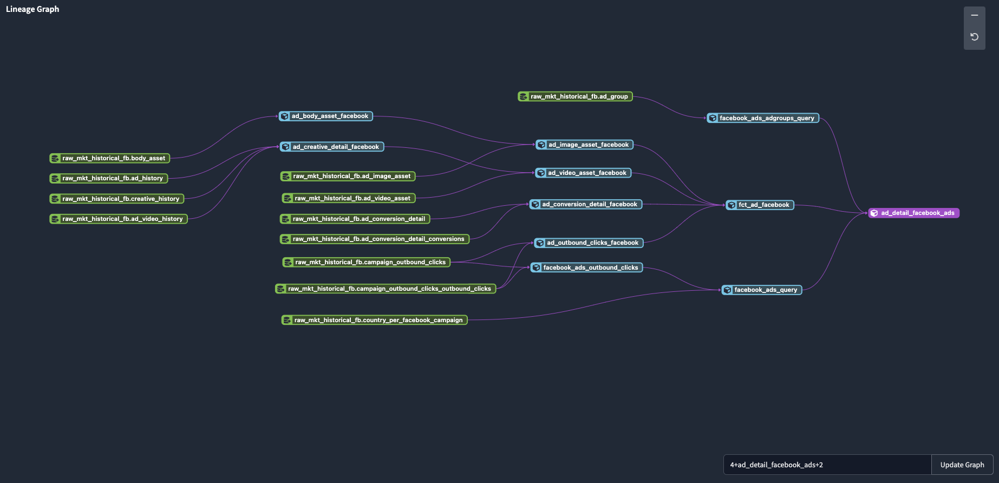

# Modeling Facebook and Google Ads data with Fiventran, Snowflake and dbt
Get data at very high level of details: for Facebook Ads, get everything to see at an ad creative level. For Google Ads, get everything at search keyword level.

# Introduction & Goals
- Using Fivetran to get raw data into Snowflake
- Adding sources to dbt setup (simplified files, overall repo is not upload)
- Transformation data inside dbt and send it back to Snowflake

# Contents

- [Used Tools](#used-tools)
  - [Fivetran](#fivetran)
  - [dbdiagram.io](#dbdiagram)
  - [Snowflake](#snowflake)
  - [dbt & Snowflake](#dbt_and_nowflake)
- [Follow Me On](#follow-me-on)

# Used Tools
- Fivetran for data ingestion
- dbdiagram.io for data modeling
- Snowflake for data warehousing
- dbt for transformation layer

# Fivetran
- Understanding Google Ads ERD: https://fivetran.com/docs/applications/google-ads 
- Understandin Facebook Ads ERD: https://fivetran.com/docs/applications/facebook-ads
- Setting up neccesary reports for final model layout.

# dbdiagram

First, after contemplating Fivetran ERDs, I've designed the star models for both cases in dbdiagram.io

### Google Ads:

### Facebook Ads:

# dbt and Snowflake

Finally, after getting the diagram done, I've started modeling all the tables to get the final results. The sources for this raw data are listed in /sources folder and the /models are as shown below:

### Google Ads:

### Facebook Ads:

# Follow Me On
Linkedin: https://www.linkedin.com/in/alejandro-aboy/ 
