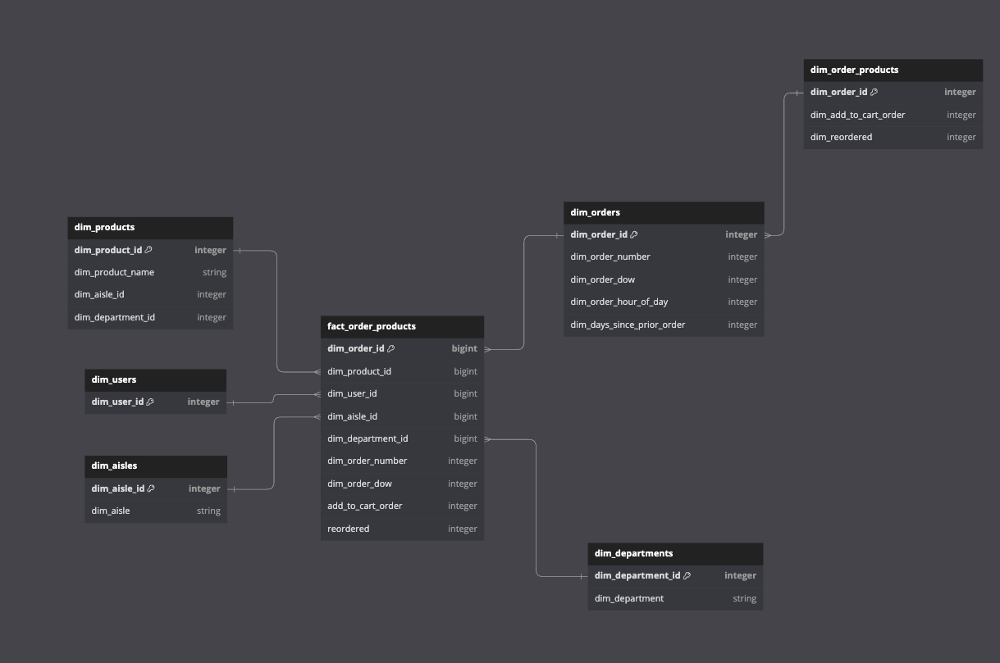
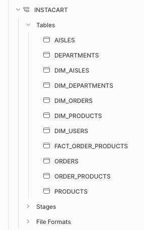

# Connecting S3 to Snowflake for dimensional modeling approach
In this small project we are getting data from a Kaggle dataset, understanding all relationships between raw files (stored in S3) and putting a fact modeling in place through Snowflake Data warehouse.

# Introduction & Goals
- Model instacart dataset from Kaggle
- Design the fact model with dbdiagram.io
- Connect S3 to Snowflake and setup a manual data modeling process.

# Contents

- [Used Tools](#used-tools)
  - [dbdiagram.io](#dbdiagram)
  - [Snowflake](#snowflake)
- [Follow Me On](#follow-me-on)

# dbdiagram

First, after contemplating Fivetran ERDs, I've designed the star models for both cases in dbdiagram.io

# snowflake
Check .sql files to see the step by step S3 integration, DDL for dimensional modeling and final fact table creation. 

# Follow Me On
Linkedin: https://www.linkedin.com/in/alejandro-aboy/ 
