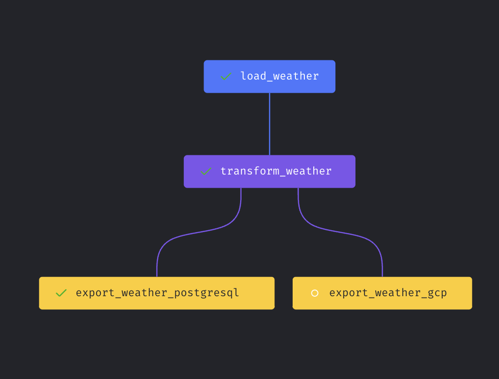
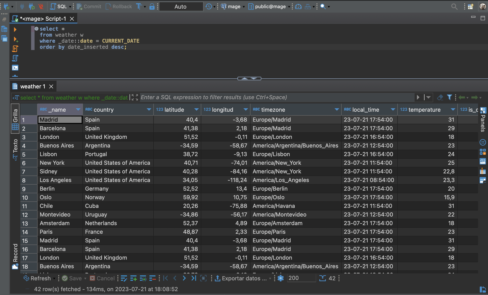
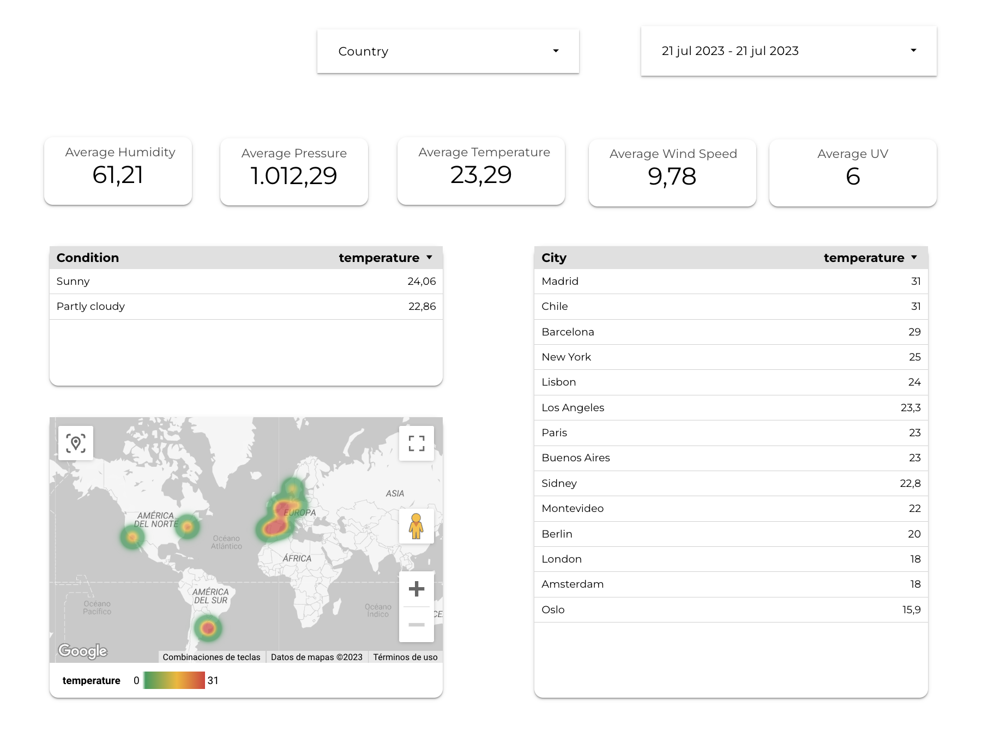

# Extracting and storing weather data every 30 minutes with Mage, PostgreSQL, GCP and Data Studio
Scrape selected countries weather and send it to PostgreSQL and GCP with an easy to consume visualization in Data Studio.

# Introduction & Goals
- Setting up Mage pipeline to request for weather data every 30' minutes.
- Using Mage to get raw data into PostgreSQL and Google Cloud Storage 
- Visualizing data in Data Studio

# Contents

- [Used Tools](#used-tools)
  - [Mage](#mage)
  - [PostgreSQL](#postgreSQL)
  - [Google Cloud Storage](#gcp)
  - [Data Studio](#data_studio)
- [Follow Me On](#follow-me-on)

# Used Tools
- Mage for pipeline orchrestation and extraction.
- PostgreSQL as RDS.
- Google Cloud Storage as data lake.
- Data Studio as BI tool.

# mage
- Setup data loader.
- Setup data transformer.
- Setup data exporter to PostgreSQL and GCP.

You can see all the pytho code in /mage

# postgreSQL

Data is added to PostgreSQL destination.

# gcp

After creating service accounts and setting up the bucket, the parquets are added to Google Cloud Storage.

# data_studio

Finally, data is reported in data studio.

# Follow Me On
Linkedin: https://www.linkedin.com/in/alejandro-aboy/ 
